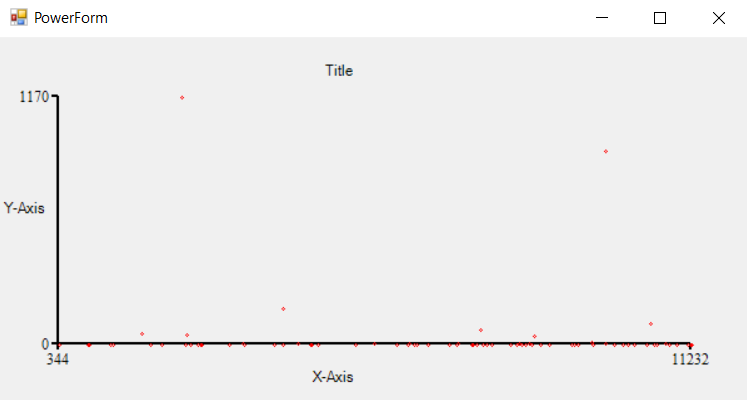

# PowerChart

This module is for Charting in PowerShell! Quickly see your data in a bar chart, line chart, or scatter chart!

## Quick Start

See more [examples in the tests](./PowerChart.FunctionalTests/PowerChart.Tests.ps1).

### Installation

This can be installed from the [PowerShell Gallery](https://www.powershellgallery.com/packages/PowerChart/0.0.4)
```PowerShell
Install-Module -Name PowerChart
```

### Usage

1. *PowerShell 5.1* has an issue with TypeData so you will need to import separately
	```PowerShell
	Import-Module -Name PowerChart
	$typedata = Get-Module -Name PowerChart | Select-Object -ExpandProperty FileList
	Update-TypeData -AppendPath $typedata
	```
1. Create a chart
	```PowerShell
	$chart = New-Chart
	```
1. Add some data to a series
	```PowerShell
	Get-Process | Add-Scatter -Chart $chart -XProperty Id -YProperty CPU -Color Red -ErrorAction SilentlyContinue
	```
1. Display the chart
	```PowerShell
	Show-Chart -Chart $chart
	```
	
1. *Optionally* wait for the chart to be closed by the user
	```PowerShell
	$chart.Dialog.Join()
	```

## Known Issues

1. I have experienced issues with PowerShell 5.1 importing TypeData during the import of the module.
The workaround is to import the TypeData manually (see Quick Start).
1. This module currently only works with `Int32` and `Double` properties.
The latter is casted into `Int32`.
1. Unfortunately `net-standard` cannot be used as good practice dictates because the `System.Windows.Forms` in `net6.0-windows` is actually
[a fork](https://github.com/dotnet/winforms) of `net481`; and not included nor compatible in `net-standard`.
Instead both versions are shipped in the same package and chosen according to the runtime environment.
